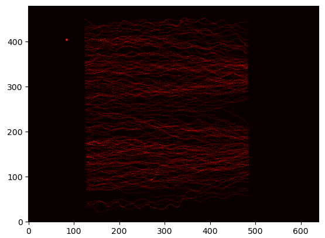

# Laboratorio 01: Cálculo de frecuencia peatonal 

**Alumnos:** Juan Pinilla, Ignacio Garín

**Docentes:** Juan Bekios, Diego Valdivia

**Ayudante:** Cristian Galleguillos

## 1. Introducción 

### 1.1 Definición del problema 

En el siguiente laboratorio se trabajará un caso de estudio relacionado con el flujo de peatones por un corredor. Se busca comprender el movimiento de las personas, analizar la densidad y la distribución de los espacios. El laboratorio será realizado mediante algoritmos en python, capaces de filtrar, almacenar, modelar y graficar información relevante para el caso.

### 1.2 Justificación 

El estudio del flujo de peatones tiene mucha relevancia para comprender el comportamiento de las personas. En diferentes condiciones, como espacio y densidad, las personas pueden tomar desvíos o incluso cambiar sus rutas, siendo determinante para el área de marketing y ventas por ejemplo. Además, para realizar este laboratorio es necesario aplicar todos los conocimientos adquiridos previamente, siendo una gran instancia de práctica que ayudará a futuro académica y profesionalmente. 

### 1.3 Objetivos 

**Objetivo General**

Analizar el comportamiento de peatones a través de un corredor.

**Objetivos específicos**

1. Preparar dataset para la manipulación de sus datos.
2. Guardar información relevante en diferentes objetos.
3. Calcular métricas para la comprensión de los datos.
4. Generar matriz de frecuencias en pixeles.
5. Crear mapa de calor de los desplazamientos.
6. Analizar desempeño computacional.

## 2. Marco teórico (800 caracteres)

**Python**: Lenguaje de programación de alto nivel, interpretado e interactivo, conocido por su simplicidad y legibilidad. Es utilizado en diversas áreas de desarrollo software debido a su facilidad de uso y su amplia comunidad.

**Visual Studio**: Editor de código fuente desarrollado por Microsoft. Es una herramienta de programación de código abierto que admite múltiples lenguajes y proporciona una amplia gama de características.

**Librerías utilizadas**

**NumPy**: Biblioteca para cálculos numéricos y manipulación de arreglos multidimensionales.

**Matplotlib**: Biblioteca para crear gráficos y visualizaciones de datos en 2D.

**Time**: Módulo para trabajar con el tiempo y medir el rendimiento en Python.

**Psutil**: Biblioteca para obtener información y controlar procesos y recursos del sistema operativo en Python.

## 3. Materiales y métodos

Se usó un dataset de nombre "UNI_CORR_500_01". El archivo de texto contenía 5 columnas y más de 25.000 filas. Describe la ubicación de las personas usando sus coordenadas x,y,z en diferentes frames. Las posiciones se expresan en metros (flotante).

El experimento busca analizar la densidad de las personas que circularon por un pasillo luego de variar la anchura de sus entradas. El procedimiento para ello consiste de varios pasos.

Lo primero es visualizar los datos. Se observa que las primeras 4 filas del dataset son solo descripciones, además que se usan espacios como separadores y que el eje Z (altura de la cámara) se mantiene fijo. Se realizó un filtrado de información y se representó el dataset en una matriz, facilitando así su manipulación.

Para la exploración de los datos, se crearon diccionarios para cada eje, cuyas claves eran las coordenadas presentes en la matriz y los valores la cantidad de veces que aparecen. Se hizo lo mismo pero para la combinación de ambas coordenadas (par ordenado).
También se crearon listas que albergaban todas las coordenadas para cada eje sin excluir repeticiones, esto por las funciones aritméticas que se pueden aplicar a listas más adelante. 

Para estudiar el movimiento de las personas se creó una matriz de frecuencia. Lo primero era representar el pasillo en pixeles, y luego cuantificar la cantidad de veces que se frecuentó cada uno. Esta distribución se pudo visualizar con un mapa de calor.

Finalmente interesaba el desempeño computacional, así que se incluyeron métricas en el experimento.

## 4. Resultados obtenidos

Luego de realizar el experimento, se pudieron calcular métricas de interés para el estudio. Empezando por los valores máximos y mínimos presentes en ambos ejes y su varianza.

| Eje   | Mínimo(mts) |  Máximo(mts) |
|-----------------------|----------------------------|-------------------------|
| X |-5.48 |4.66|
Y |0.21|4.70

| Eje   | Varianza |
|-----------------------|------------------------|
| X |8.29|
Y |1.32|

Se observa una gran varianza en el eje x, esto es debido al desplazamiento de las personas a lo largo del pasillo, lo cual es positivo.

Usando diccionarios se pudo hallar las coordenadas y pares ordenados más frecuentes, pero esto no fue muy representativo a simple vista pues los máximos eran compartidos por varias posiciones. Para visualizar realmente las zonas más concurridas se realizó un mapa de calor, representando la matriz de frecuencia.

En general el movimiento de los peatones tiene una ligera tendencia a alejarse de la zona central formando dos carriles, no hay desvíos considerables y tampoco una ruta de preferencia. Esto es positivo pues el objetivo es descongestionar el tráfico de peatones y se observa que estos se mueven por distintos flancos.

Sobre el desempeño computacional, se muestran algunos parámetros a continuación.

El código se ejecutó en 6 segundos y usó un 10% de la memoria CPU. Se estima que el trabajo más pesado es llenar la matriz de frecuencia debido a sus dimensiones (640x480) y formar los diccionarios de frecuencia.

## 5. Conclusiones

Para realizar este experimento se utilizaron todos los fundamentos trabajados en clases: manejo de variables, ciclos, condiciones, listas, diccionarios, matrices, funciones, librerías, etc. 

Sobre el caso, se puede concluir que el dataset de estudio era adecuado y que el comportamiento de los peatones no está fuertemente determinado, no hay desvíos muy pronunciados, hay zonas menos pobladas y se observa holgura en los desplazamientos, indicando un adecuado uso de los espacios.

Computacionalmente, el código se ejecutó de forma eficiente, tardando 6 segundos o en ocasiones menos, y ocupando un bajo porcentaje de la CPU. Se evitaron prácticas poco óptimas como ciclos anidados o repetición de código.

La importancia de este laboratorio radica en el uso de los conocimientos teóricos en un caso práctico, desde la preparación de los datos hasta la visualización de los resultados. El movimiento de las personas puede explicar sus tendencias en diferentes aspectos, como las compras en un supermercado, un partido de fútbol o una exhibición, por lo que los conocimientos adquiridos pueden ser valiosos en la vida profesional.